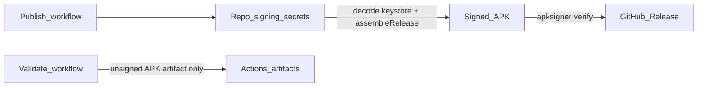

# Playbook 01 — Release signing CI

## Problem / when you need this

You ship Android APKs from GitHub Actions and hit:

- Users install “release” builds that are actually **unsigned** Actions artifacts → `INSTALL_PARSE_FAILED_NO_CERTIFICATES`
- Signing secrets missing on some runs, present on others → flaky publish
- `apksigner` picked from the wrong Build Tools folder → false verify or tool-not-found

## Recommended architecture



**Rules:**

1. **Validate** never needs signing secrets; never creates GitHub Releases.
2. **Publish** always verifies with the **exact** Build Tools version your project pins.
3. Use one **persistent** production keystore (never generate on the runner).

## Concrete checklist

- [ ] Single-source `android.buildTools=X.Y.Z` in `gradle.properties`
- [ ] CI installs `build-tools;$build_tools` and sets `ANDROID_BUILD_TOOLS`
- [ ] Verify with `"$ANDROID_HOME/build-tools/$ANDROID_BUILD_TOOLS/apksigner"` (not `find` + `tail`)
- [ ] Four secrets: keystore Base64, store password, key alias, key password
- [ ] Soft-skip publish when secrets missing on automatic runs; **fail** on explicit “publish now”
- [ ] Document: Releases = installable; Actions artifacts = validation only

## Pitfalls we hit + fixes (Neo)

| Pitfall | Fix |
| --- | --- |
| Users installed unsigned validation APKs | README + docs: Releases only |
| Ephemeral debug certs on early Releases | Persistent keystore; uninstall old `sha-*` debug builds before update |
| Expression `run_number + 100000` rejected by actionlint | Use shell arithmetic `$((GITHUB_RUN_NUMBER + 100000))` (later replaced by SemVer encoding) |
| Soft-skip vs hard-fail unclear | `scripts/ci/check_release_signing.sh` + `PUBLISH_EXPLICIT` |

## File map

| Neo | In your app |
| --- | --- |
| `.github/workflows/publish-apk.yml` | Publish / release workflow |
| `.github/workflows/release-build.yml` | PR validation workflow |
| `scripts/ci/check_release_signing.sh` | Secret presence policy |
| `app/build.gradle.kts` `signingConfigs` | CI signing config gated on env |
| `gradle.properties` `android.buildTools` | Pin Build Tools |

## Validation

```bash
# Policy script (with temp GITHUB_OUTPUT)
PUBLISH_EXPLICIT=false GITHUB_REF=refs/heads/main \
  GITHUB_OUTPUT=/tmp/out GITHUB_STEP_SUMMARY=/tmp/sum \
  bash scripts/ci/check_release_signing.sh

python3 -m unittest discover -s scripts/ci -p 'test_*.py'
```

After a real publish, verify with the **pinned** Build Tools binary (`ANDROID_BUILD_TOOLS` must match `gradle.properties` / the publish job), using the exact APK path (not a bare `apksigner` on `PATH`):

```bash
"$ANDROID_HOME/build-tools/$ANDROID_BUILD_TOOLS/apksigner" verify --verbose --print-certs \
  "language-selector-v${VERSION_NAME}-${SHORT_SHA}.apk"
```

Compare cert SHA-256 to your recorded fingerprint.
