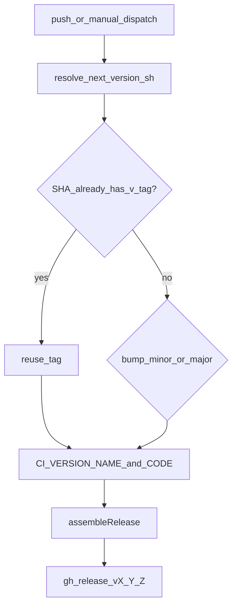

# Playbook 02 — SemVer Android versioning

## Problem / when you need this

- `versionName` stuck (e.g. always `2.0.0`) while Releases are named by commit SHA
- `versionCode` from `run_number` unrelated to user-visible version
- Need **minor** bumps on every ship, **major** only when a human chooses

## Recommended architecture



**Encoding:**

```text
versionCode = major * 1_000_000 + minor * 1_000 + patch
```

Each component must be **canonical** `0…999`: either `0` or `[1-9]` plus at most two more digits (no leading zeros). Reject before Bash `10#` arithmetic.

**Tag policy:**

- Only tags matching canonical components count, e.g. `^v(0|[1-9][0-9]{0,2})\.(0|[1-9][0-9]{0,2})\.(0|[1-9][0-9]{0,2})$`
- Oversized tags such as `v1000.0.0` and non-canonical tags such as `v0000.0.0` are **skipped** when selecting latest / SHA tags
- Ignore `sha-*`, `latest`, etc.
- Fallback “last released” when no valid `v*` tags: e.g. `2.0.0` → next minor `2.1.0`
- Same commit re-run: reuse existing valid `v*` tag on that SHA (idempotent)

## Concrete checklist

- [ ] `versionName = System.getenv("CI_VERSION_NAME") ?: "X.Y.Z"`
- [ ] `versionCode` from env (or encoded SemVer) with range checks
- [ ] Resolver script writes GitHub Actions outputs: `version_name`, `version_code`, `tag`, `reused`
- [ ] Checkout with tags (`fetch-depth: 0` + `git fetch --tags`)
- [ ] Push → force minor; workflow_dispatch → choice `minor` \| `major`
- [ ] Release title/tag = `vX.Y.Z`; APK name includes version + short SHA

## Pitfalls we hit + fixes (Neo)

| Pitfall | Fix |
| --- | --- |
| SHA tags never bump About version | SemVer resolver + `CI_VERSION_NAME` |
| `10#$n >= 1000` can overflow on huge digit strings | Reject `${#component} -gt 3` before `10#` |
| Leading zeros parsed as octal in Bash | Always use `10#$component` in arithmetic |
| Rerun double-bumps | If SHA already has `v*` tag, reuse |

## File map

| Neo | In your app |
| --- | --- |
| `scripts/ci/resolve_next_version.sh` | Version bump script |
| `app/build.gradle.kts` `CI_VERSION_NAME` / `CI_VERSION_CODE` | Injected version fields |
| `publish-apk.yml` Resolve + Export SemVer steps | Wire env before Gradle |
| `scripts/ci/test_release_configuration.py` | Regression for bump math |

## Validation

```bash
# In a throwaway git repo with tags, or via Neo’s unit tests:
python3 -m unittest discover -s scripts/ci -p 'test_*.py'
```

Expect: no tags + minor → `2.1.0` / code `2001000`; `v2.1.0` + major → `3.0.0` / `3000000`.
