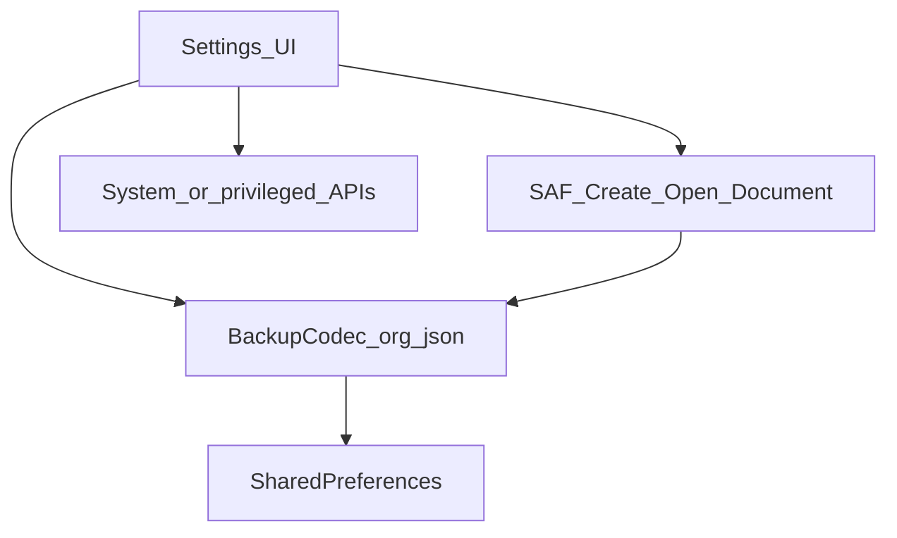

# Playbook 06 — JSON backup and SharedPreferences patterns

## Problem / when you need this

You need portable backups (presets, settings, pin lists) without Room migrations or heavy serializers, and you must survive:

- Corrupt / truncated files
- Partial arrays
- Schema upgrades

## Recommended architecture



**Design rules:**

1. **`schemaVersion` integer** in every export; reject unsupported versions with a clear error.
2. Prefer **`opt*`** / skip bad entries over `get*` that throws mid-list.
3. Map parse failures to **`IllegalArgumentException("Invalid …")`** so UI can show `e.message`.
4. Prefs load paths should **never crash the screen** — return empty on corrupt JSON.
5. Enforce **decode-time** payload and collection limits (Neo: `MAX_JSON_CHARS=1_000_000`, `MAX_APPS=2_000`, `MAX_PINNED=500`, `MAX_PRESETS=10`) — reject oversize imports rather than silently truncating.

**Apply semantics for “snapshot” restores (locale presets):**

1. Set every entry in the snapshot.
2. Clear current items **not** in the snapshot (full restore of that moment).

## Concrete checklist

- [ ] Document JSON shape in README or docs
- [ ] Unit-test encode/decode round-trip **and** malformed inputs
- [ ] Use SAF (`CreateDocument` / `OpenDocument`) for user-visible files
- [ ] UTF-8 bytes explicitly
- [ ] After import, request a UI refresh of dependent screens

## Pitfalls we hit + fixes (Neo)

| Pitfall | Fix |
| --- | --- |
| `JSONObject(json)` threw into Settings init | `loadPresets` catches `JSONException` → `emptyList()` |
| `getString("id")` blew up one bad preset | `optString` + skip blanks; skip non-objects in arrays |
| `decodeBackup` leaked `JSONException` | Catch → `IllegalArgumentException("Invalid backup JSON", e)` |
| JVM tests “JSONObject not mocked” | Real `org.json` test dependency (playbook 08) |

## File map

| Neo | In your app |
| --- | --- |
| `data/LocaleBackupCodec.kt` | Codec object |
| `data/LocaleBackupModels.kt` / `PrefConstants` | Models + pref keys |
| `data/LocaleSnapshot.kt` | Collect/apply domain logic |
| `ui/screen/settings/SettingsVm.kt` | Orchestration + SAF streams |
| `LocaleBackupCodecTest` | JVM tests |

## Validation

```bash
./gradlew --no-daemon testDebugUnitTest --tests '*LocaleBackupCodecTest*'
```

Manual: export → clear pins → import → pins and apps restored.
