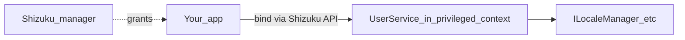

# Playbook 07 — Shizuku and privileged IPC

## Problem / when you need this

Your app must call privileged Android APIs (here: per-app locales) without being a system app. Shizuku (or root) brokers that access. Confusion usually comes from:

- **Manager APK version** ≠ **Maven client library version**
- One failing binder call aborting a batch
- Init of root/shell libraries in the wrong lifecycle phase

## Recommended architecture



**Versioning rule (portable):**

> Pin Maven artifacts to the API version **embedded by the manager you support**, not the manager’s marketing version tag.

Neo example: `thedjchi/Shizuku` **v13.7.0** embeds Shizuku-API **13.1.5** → depend on `dev.rikka.shizuku:api:13.1.5` and `provider:13.1.5` from Maven Central.

**Batch IPC rule:**

```kotlin
for (pkg in packages) {
    try {
        service.setSomething(pkg, value)
    } catch (_: Exception) {
        // continue — one failure must not abort the batch
    }
}
```

Match the same isolation on **reads** (`getSomething`).

**Shell / libsu init:**

Configure default builders in `Application.onCreate()`, not in Activity `init {}` blocks.

## Concrete checklist

- [ ] Document manager vs API version in README
- [ ] CI check that Maven artifacts resolve (Neo: `verify_shizuku_artifacts.py`)
- [ ] Gate privileged UI on “service connected”
- [ ] Isolate per-target failures in loops
- [ ] Clear user-facing errors when binder unavailable

## Pitfalls we hit + fixes (Neo)

| Pitfall | Fix |
| --- | --- |
| Assumed Maven coords match manager tag `13.7.0` | Use API **13.1.5**; document the distinction |
| Rikka Maven repo / resolution pain | Prefer Maven Central coordinates |
| `Shell.setDefaultBuilder` in Activity init → crash | Move to `App.onCreate()` |
| Apply snapshot aborted mid-list | try/catch per `setApplicationLocales` |

## File map

| Neo | In your app |
| --- | --- |
| `gradle/libs.versions.toml` Shizuku entries | Dependency pins |
| `scripts/ci/verify_shizuku_artifacts.py` | Artifact availability gate |
| `service/UserServiceProvider` | Binder access wrapper |
| `data/LocaleSnapshot.kt` | Batch apply/collect |
| `App.kt` | Process-wide Shell setup |

## Validation

```bash
python3 scripts/ci/verify_shizuku_artifacts.py
# Device: grant Shizuku, Proceed, change one app locale, reboot app, confirm persistence
```
